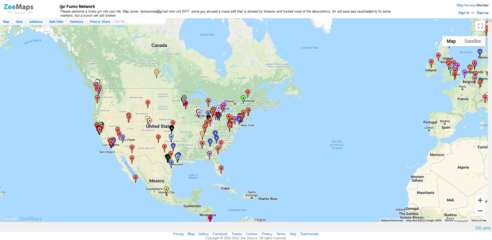

In the old time when the /jp/ fumo threads were the main western fumo community, we had a public Zeemaps where users could share a rough location and share an image of their fumos. It made for a nice quick view on where the western community was clustered and helped build the community.

The map would get posted in the OP so everyone would see it and be able to contribute, but at some point, we had a bad egg who destroyed the map somehow.

Zeemaps at some point closed down the map because of limits and they require the owner to pay for others access it. Because of this, a new fumo-only map was created solely for the [Discord server](https://discord.gg/fumofumo).

It's a bit more primitive, but accomplishes essentially the same result. If you'd like to place your own marker in the new version, head on over to [alphatown.fumo.systems](https://alphatown.fumo.systems/) and sign in with Discord to add to the map!